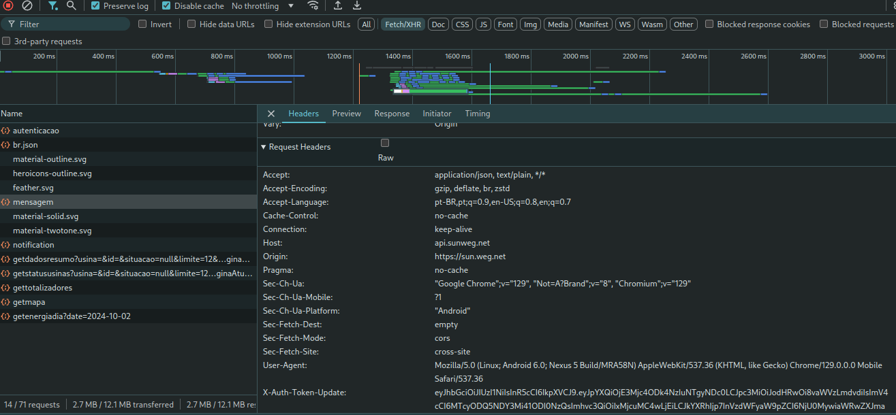

# SunWeg

[](https://github.com/rokam/sunweg/actions/workflows/python-build.yml)


Python lib for WEG solar energy platform, [SunWEG.net](https://sunweg.net/)

## Usage

### Retrieve token
You need to use devtools from your browser to retrieve the token. In most of them, you can open devtools by pressing F12.
Inside the network tab, you need to check the preserve logs and then do a login.

You can find the token in the request header of various XHR requests, for example:


It will be available in the X-Auth-Token-Update header.

### Code sample
``` python
from sunweg.api import APIHelper

api = APIHelper(token='your token here')
plants = api.listPlants()
for plant in plants:
    print(plant)
    for inverter in plant.inverters:
        print(inverter)
        for phase in inverter.phases:
            print(phase)
        for mppt in inverter.mppts:
            print(mppt)
            for string in mppt.strings:
                print(string)
```

## Documentation

Check the [DOCs](https://github.com/rokam/sunweg/blob/main/docs/index.md) for API documentation.

## Contribute

Feel free to send issues and pull requests.
